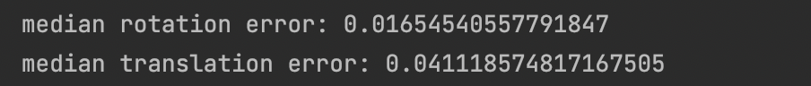
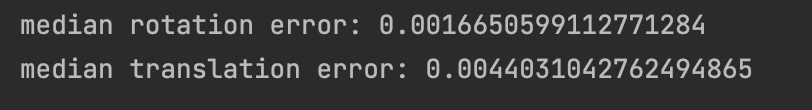
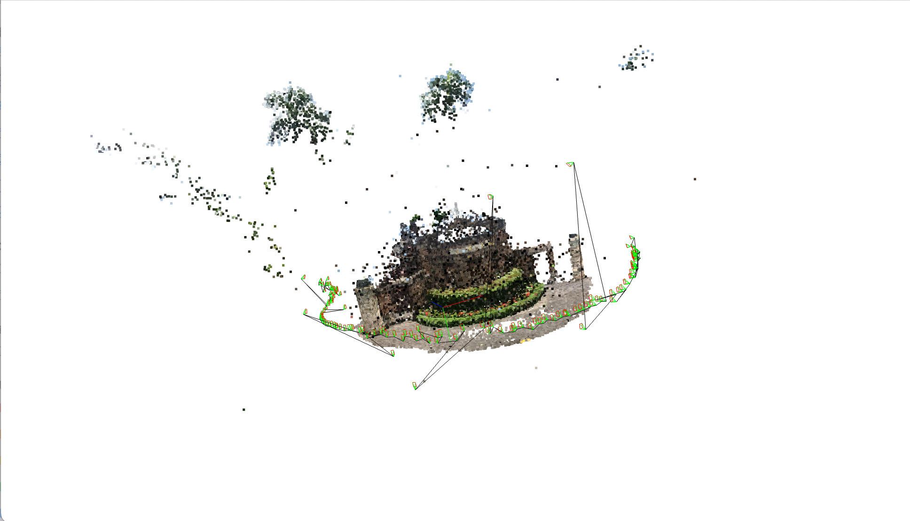
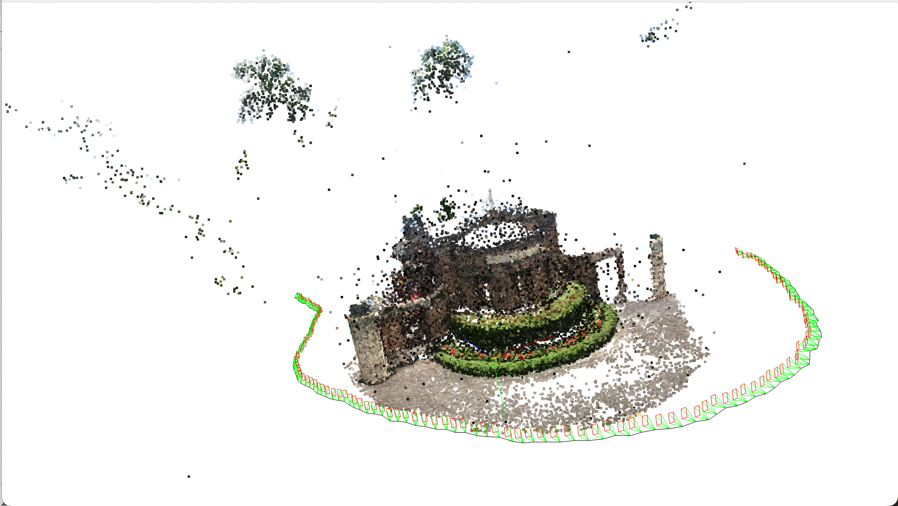
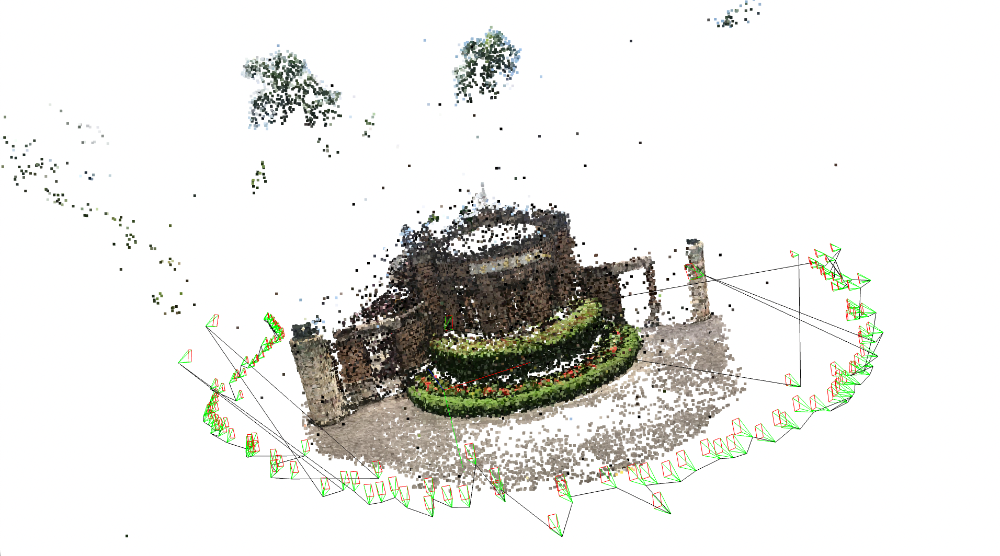
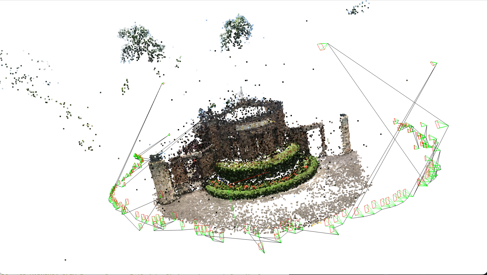
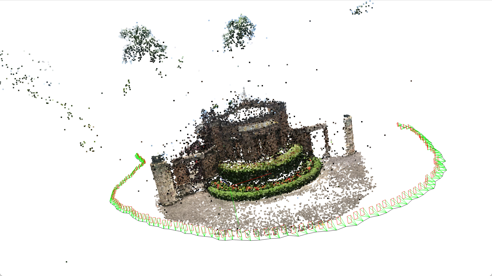

# **Camera Pose Estimation**
 
## **Problem 1: 2D-3D Matching**
Dataset: [Download](https://drive.google.com/u/0/uc?export=download&confirm=qrVw&id=1GrCpYJFc8IZM_Uiisq6e8UxwVMFvr4AJ)<br>


### **Q1-1 Implementation**
```sh
Algorithm Find camera extrinsic matrix

Input: Camera intrinsic matrx, 3D points and its descriptor, 2D points and its descriptor
Output: Rotation matrix, Translation vector

points2D, points3D =  Function(Matching pair by using desciptors of 3D points and 2D points)

Remove distorted effect on points2D

Rotation matrix, Translation vector = Function(RansacP3P)

Return Rotation matrix, Translation vector
```

```sh
Algorithm RansacP3P

Input: Camera intrinsic matrx, 3D points 2D points matching pairs
Output: Best fit Rotation matrix, Best fit Translation vector

Do iteration N times
   Random sample 4 pairs from top 200 best matches 
   
   estimated rotation matrix,estimated translation vector = Function(P3P) 
   
   For each 2D,3D point pair
      
      Project 3D point by extrinsic matrix got from last instruction to 
      get estimated 2D point 
      
      Check distance D of estimated 2D point and Ground Truth 2D point
      
      If D < 0.1
         Inlier = Inlier + 1
   
   If Inlier > Best Inlier:
      
      Best Inlier = Inlier
      
      Best fit Rotation matrix = estimated rotation matrix
      
      Best fit Translation vector = estimated translation vector

Return Best fit Rotation matrix, Best fit Translation vector   

```

```sh
Algorithm P3P

Input: Camera intrinsic matrx, four 3D points 2D points matching pairs
Output: Estimated Rotation matrix, Estimated Translation vector

Points of 2D (u1,u2,u3,u4)
Points of 3D (x1,x2,x3,x4)

Using (u1,x1),(u2,x2),(u3,x3) to calculate

Using(u4,x4) to select solution

(v1,v2,v3) = inv_intrinsic_matrix dot (u1,u2,u3)

Calculate coefficients of polynomial

Get real solutions of quartic polynomial 

Get other parameters(a,b,c,y) by real solution

Get translation vectors by calulate intersection points of 3 circles origin points(x1,x2,x3) and its distance(a,b,c) to intersection points using trilateration method

Get Lambda of each v

For each (lambda, v, x, translation vector)  pair 
   
   Get rotation matrix by (lambda, v, x, translation vector) 
   
   If det(rotation matrix) close to 1
      
      Let it be candidate rotation matrix
   
   Else
      
      Neglect this rotation matrix

For each candidate rotation matrix
   
   u,s,vh = SVD(candidate rotation matrix)
   
   candidate rotation matrix = u x vh

For each candidate rotation matrix
   
   Project x4 by extrinsic matrix to get estimated 2D point 
   
   Get projection error with Ground Truth
   
   If error < Smallest error:
      
      Estimated Rotation matrix = candidate rotation matrix
      
      Estimated Translation vector = vector binded with candidate rotation matrix

Return Estimated Rotation matrix, Estimated Translation vector
```


### **Q1-2 Error**
**P3P**

**P3P + Ransac**


#### **Discussion:**<br> 
According the result, RANSAC can remove outliers. Because of median error, we don't know how good the whole estimation is, so we need to see visual result according to plot trajectory. <br>
### **Q1-3 Trajectory**
#### **Explain:**<br>
I loaded rotation vectors and translation vectors gotten before. Optical center is translation vector, and I applied rotation vector on image plane to show the bearing of camera.<br>
For drawing trajectory, I sorted the val images by name and create lines between two optical centers of two neighbor points.<br>
#### **Trajectory:**
**P3P**

**P3P + Ransac**


#### **Discussion:**
We can see that RANSAC can remove ouliers by draw the trajectory pratically. Black line is trajectory.


### **Discussion of train and val**
In this homework, we get the 3D point descriptor by averaging all the correspondence 2D points' descriptors in training images, so it is important that we should have many descriptors of the same 3D point because the 2D point in image may be influnced from light, viewport, etc. If we have not sufficient training points, it may have bad result.<br>
**Experiment**<br>
I removed 50% and 80% of 2D points correspondence to each 3D point, and see the effect.

**Remove 50%,P3P**
```sh
python trajectory.py --r ./pose/Rotation50_no_ransac.npy --t ./pose/Translation50_no_ransac.npy
```


**Remove 80%,P3P**
```sh
python trajectory.py --r ./pose/Rotation80_no_ransac.npy --t ./pose/Translation80_no_ransac.npy
```


**Remove 50%,P3P+Ransac**
```sh
python trajectory.py --r ./pose/Rotation50.npy --t ./pose/Translation50.npy
```


**Remove 80%,P3P+Ransac**
```sh
python trajectory.py --r ./pose/Rotation80.npy --t ./pose/Translation80.npy
```


We can see that the results of using P3P are worse than without removing any point in Q1-3, I considered that removing points is same as creating more outliers because we can have a weak descriptor of 3D point. Contrast to P3P, there are almost nothing change on using P3P+Ransac, it is because Ransac can remove outliers, so it doesn't be influenced


## **Problem 2: Augmented Reality**
### **Q2-1 Error**
#### **Explain:**<br>
I loaded rotation vectors and translation vectors gotten before and loaded cube position I created from transfrom_cube.py. And then get val images sequence sorted by name. Because I know the extrinsic matrix of all images and I also have intrinsic matrx, I can know 3D-2D correspondece of 3D world and image coordinate. Then I can project points of cube to image plane, plot points that its project point is in image plane, and with painter algorithm, I plot points from long distance to small distance with camera optical center.


## **Build environment**
```shell
conda create --name 3dcvhw2 python=3.8 
conda activate 3dcvhw2
pip install -r requirements.txt 
```

## **How to run code**

### Q1-1 Q1-2

```sh
python myself2d3dmatching.py
```
The error of each val image will show on terminal, and after all val images finished execution, median rotation error and translation error will show on screen. Two files will be generated after execution, Rotation.npy(in pose directory and Translation.npy(in pose directory) which store the rotation and translation of each val image.

### Q1-3
```sh
python trajectory.py --r [path to Rotation vector npy file] --t [path to Translation vector npy file]
```
**Example**
```sh
python trajectory.py --r ./pose/Rotation.npy --t ./pose/Translation.npy
```
This program load Rotation.npy and Translation.npy generated from myself2d3dmatching.py, draw camera pose and trajectory, and then show the result.

### Q2-1
```sh
python AR.py --r [path to Rotation vector npy file] --t [path to Translation vector npy file] --c [path to cube vertices npy file]
```
**Example**
```sh
python AR.py --r ./pose/Rotation.npy --t ./pose/Translation.npy --c ./cube/cube_vertices.npy
```
This program load Rotation.npy and Translation.npy generated from myself2d3dmatching.py and cube_vertices.npy generated from transform_cube.py, and then generate output.mp4 in video folder to store the result.
